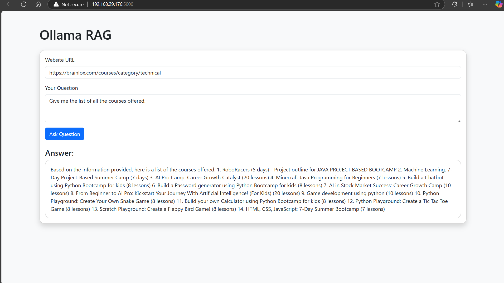

# Ollama RAG - Retrieval Augmented Generation

## Overview
Ollama RAG is a web-based Retrieval-Augmented Generation (RAG) system that extracts relevant information from web pages and enhances question-answering using a powerful language model. It utilizes **Ollama**, **ChromaDB**, and **LangChain** to retrieve, process, and generate responses dynamically.

## Features
- Web-based document retrieval and text splitting
- Context-aware question answering
- Uses **Mistral** model for intelligent responses
- Stores embeddings with **ChromaDB** for efficient searches
- Provides a REST API for easy integration
- Cross-Origin Resource Sharing (**CORS**) enabled

## Tech Stack
- **Backend**: Flask, LangChain, ChromaDB, Ollama
- **Frontend**: Static files (HTML, CSS, JavaScript)
- **ML Models**: Mistral (via Ollama)

## Installation
### Prerequisites
Ensure you have the following installed:
- Python 3.8+
- Ollama installed ([Guide](https://ollama.com))
- ChromaDB
- Required Python packages:
  ```sh
  pip install flask flask-cors langchain langchain-community chromadb bs4 ollama
  ```

### Running the Application
1. Clone this repository:
   ```sh
   git clone https://github.com/shreyasmysore24/Ollama-RAG.git
   ```
2. Start the Flask server:
   ```sh
   python app.py
   ```
3. Access the frontend via `http://localhost:5000/`.

## API Endpoints
### **1. Retrieve Answers using RAG**
**Endpoint:** `POST /api/rag`

#### **Request Body (JSON):**
```json
{
  "url": "https://example.com/article",
  "question": "What is the main topic of this article?"
}
```

#### **Response (JSON):**
```json
{
  "answer": "The article discusses..."
}
```

## Project Structure
```
/ollama-rag
│── /frontend          # Static frontend files
│── app.py             # Flask backend
│── requirements.txt   # Python dependencies
│── README.md          # Documentation
```

## Snapshot


## Future Enhancements
- Add multi-document retrieval
- Improve response summarization
- Enhance frontend UI with interactive features

## License
This project is licensed under the MIT License.

## Contributors
- @shreyasmysore24

---
*Ollama RAG - Powering web intelligence with AI!* 🚀

